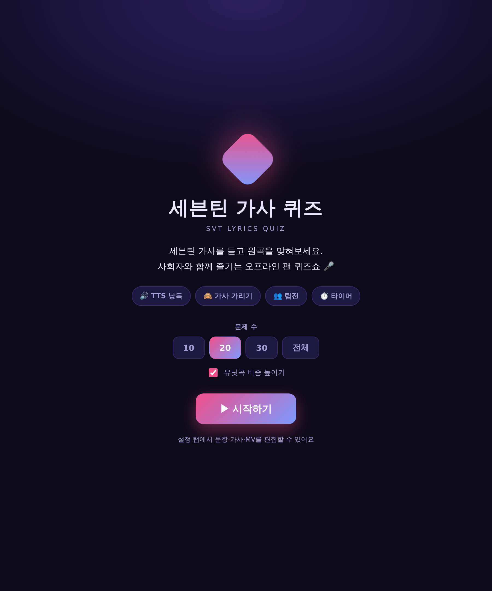
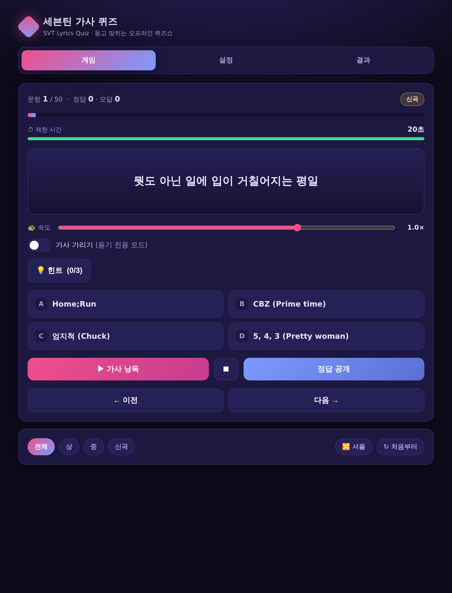
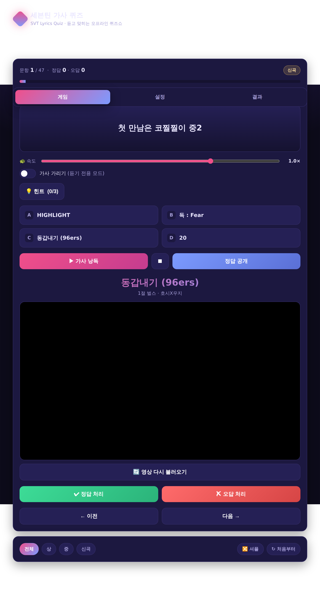
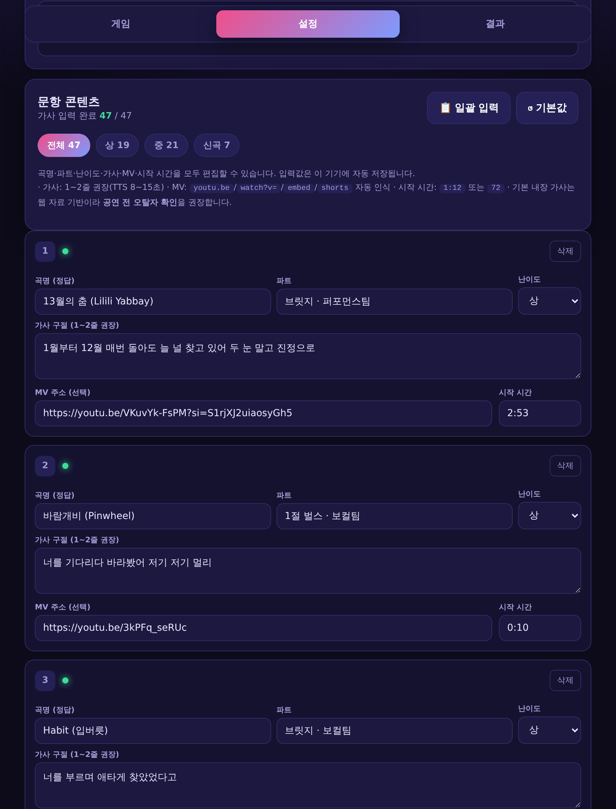
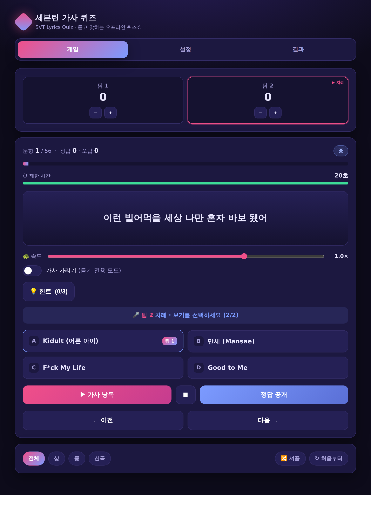
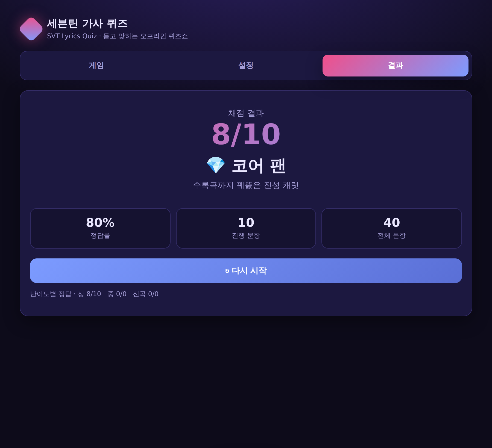

<div align="center">

# 🎤 세븐틴 가사 퀴즈 · SVT Lyrics Quiz

**세븐틴 가사를 음성(TTS)으로 듣고 원곡을 맞히는 오프라인 팬 퀴즈쇼 도구**

설치·빌드·서버 없이 `index.html` **파일 하나**로 동작합니다. · 팬 제작 · 비영리

### ▶︎ [지금 바로 플레이하기](https://htmlpreview.github.io/?https://github.com/Alfira0526/SVT_Lyrics/blob/main/index.html)

<sub>브라우저에서 바로 실행됩니다 · Chrome/Edge 권장 · GitHub Pages 링크는 아래 [웹으로 공유하기](#-웹으로-공유하기) 참고</sub>

</div>

---

## 📑 목차
- [무엇인가요](#-무엇인가요)
- [스크린샷](#-스크린샷)
- [바로 시작하기](#-바로-시작하기)
- [웹으로 공유하기](#-웹으로-공유하기)
- [게임 기능](#-게임-기능)
- [문항 구성](#-문항-구성)
- [설정·데이터 입력](#-설정데이터-입력)
- [자주 묻는 질문](#-자주-묻는-질문-faq)
- [문서](#-문서)
- [저작권 안내](#-저작권-안내)

---

## 🎯 무엇인가요

기존 K-POP 가사 퀴즈는 **텍스트를 눈으로 읽어** 변별력이 낮고, 인트로 맞히기는 **멜로디에 의존**해
가사 이해도를 측정하지 못합니다. 이 도구는 **청각 단일 채널(TTS 낭독)** 로 정보를 제한해
**가사 자체의 기억**만으로 곡을 맞히게 합니다.

- 수록곡·유닛곡·솔로곡·최신곡까지 포함해 **코어 팬(칼럿)** 을 변별
- 정답 직후 해당 파트 **MV를 지정 시점부터 재생** → 정답 확인 + 감상 + 오답자 학습
- **사회자 1명 + 참가자 다수** 구성의 소규모 모임에 최적 (화면 미러링·프로젝터 공유)

---

## 📸 스크린샷

<div align="center">



<sub>시작 화면 · ▶ 시작하기</sub>

</div>

| 게임 (문항 낭독) | 정답 공개 + MV |
|:---:|:---:|
|  |  |

| 설정 (곡·가사 편집) | 팀전 모드 + 타이머 | 결과·등급 |
|:---:|:---:|:---:|
|  |  |  |

---

## 🚀 바로 시작하기

1. 이 저장소의 **`index.html`** 을 내려받아 **Chrome 또는 Edge**로 엽니다.
   (한국어 TTS 음성 엔진 안정성 때문에 Chrome/Edge를 권장합니다.)
2. **40문항이 기본 내장**되어 있어 바로 플레이할 수 있습니다.
3. 사회자 화면을 참가자와 공유(미러링·프로젝터)하고 **가사 가리기**를 켜면 듣기 전용 모드가 됩니다.

> 별도 설치·인터넷 연결이 없어도 게임 로직은 동작합니다. (MV 재생만 인터넷 필요)

---

## 🌐 웹으로 공유하기

파일을 나눠주지 않고 **링크 하나로** 공유하려면 두 가지 방법이 있습니다.

### A. 즉시 공유 (설정 없음)
[htmlpreview](https://htmlpreview.github.io) 뷰어에 raw 주소를 넘기면 바로 실행됩니다.
```
https://htmlpreview.github.io/?https://github.com/Alfira0526/SVT_Lyrics/blob/main/index.html
```

### B. 깔끔한 영구 URL — GitHub Pages
저장소 **Settings → Pages → Source: Deploy from a branch → `main` / (root)** 저장 → 약 1분 뒤 공개됩니다.
```
https://alfira0526.github.io/SVT_Lyrics/
```

> ℹ️ **TTS 음성**은 링크를 여는 사람의 브라우저·기기에 한국어 음성 엔진이 있어야 재생됩니다.
> 온라인으로 공유하더라도 참가자에게 **Chrome/Edge** 사용을 권장하세요.

---

## 🎮 게임 기능

진행 흐름: **가사 낭독(TTS) → 참가자 응답 → 정답 공개 → MV 재생 → 사회자 채점 → 다음 문항**

| 기능 | 설명 |
|---|---|
| 🔊 **TTS 낭독 + 속도 조절** | `SpeechSynthesis`로 가사를 읽어줍니다. 0.5~1.2배 속도(느리게=난이도↓, 빠르게=난이도↑) |
| 🙈 **가사 가리기 토글** | 화면의 가사를 흐리게 처리 → 듣기만으로 맞히는 변별 모드 |
| 💡 **3단계 힌트** | 문항마다 약→중→강 힌트: ① 파트/유닛 → ② 제목 초성 → ③ 첫 글자 공개 |
| 🔤 **4지선다 (객관식)** | 설정에서 켜면 문항마다 곡명 보기 4개(정답 1 + 실제 곡 오답 3) 제공. 클릭하면 정답/오답 표시 후 공개 |
| 🎬 **정답 공개 + MV 타임스탬프** | 곡명·파트 표시 후 등록된 유튜브 MV를 **지정 시작 시간부터 자동재생** |
| ✍️ **사회자 수동 채점** | 구어·약칭·영문/한글 표기 혼용 응답을 유연하게 인정 (자동 채점의 오판정 방지) |
| 🎚️ **난이도 필터 / 셔플** | 상·중·신곡만 골라 출제하거나 순서를 랜덤화 |
| 🔢 **문제 수 선택 + 랜덤 출제** | 시작 화면에서 10/20/30/전체 중 선택 → 그만큼 랜덤으로 뽑아 출제 |
| 🧩 **유닛곡 비중 높이기** | 시작 화면 옵션(기본 ON). 부분 출제 시 유닛곡(퍼포먼스·힙합·보컬팀·부석순 등)을 더 자주 뽑음 |
| ⏱️ **타이머** | 문항별 제한 시간(초 설정), 0 도달 시 알림 |
| 👥 **팀전 모드** | 팀별 점수판·턴 관리, 타이머와 함께 쓰면 남은 시간만큼 **시간 보너스** 가산 |
| 🏆 **결과·등급** | 정답률에 따라 입덕 준비생 🐣 → 라이트 팬 🌱 → 찐팬 ⭐ → 코어 팬 💎 → 칼럿 인증 🏆 |

---

## 📝 문항 구성

- 총 **41문항** (상 14 / 중 20 / 신곡 7) — 전곡 가사 입력, 유닛곡 다수 포함
- 초기 앨범 수록곡·유닛곡·솔로곡·최신곡을 두루 포함해 코어 팬을 변별
- 타이틀곡 후렴을 지양하고 **벌스·랩·브릿지** 위주로 파트를 선정 (곡명이 가사에 나오는 구간은 배제)
- 시작 화면에서 **문제 수를 골라 랜덤 출제**할 수 있고, **유닛곡 비중 높이기**로 유닛곡을 더 자주 뽑을 수 있습니다

**난이도 정의**
- **상** — 벌스·랩·브릿지. 앨범을 반복 청취한 팬만 인지 가능
- **중** — 1절·세컨 후렴. 곡은 알지만 즉답은 어려운 수준
- **신곡** — 2024~2025 발매분(정규·유닛). 최신 앨범 소비 여부 측정

> 전체 곡 목록(곡명·파트·난이도)은 **[데이터 스펙 문서](docs/DATA_SPEC.md)** 에 표로 정리되어 있습니다.

---

## ⚙️ 설정·데이터 입력

**설정** 탭에서 곡명·파트·난이도·가사·MV 주소·시작 시간을 모두 편집할 수 있고, 곡 추가/삭제도 가능합니다.
입력값은 브라우저 **localStorage에 자동 저장**됩니다.

- **가사** — 문항당 1~2줄 권장 (TTS 낭독 8~15초가 적정)
- **MV 주소** — `youtu.be` / `watch?v=` / `/embed/` / `/shorts/` 형식 자동 인식
- **시작 시간** — `1:12` 또는 초 단위 정수(`72`). 해당 가사보다 **3~5초 앞**을 권장
- **🗂 저장 슬롯 (여러 벌 저장)** — 현재 구성을 **이름 붙여 여러 개 저장**하고 언제든 불러올 수 있습니다.
  (예: "1차 모임용", "상 난이도 세트") 각 슬롯은 이 기기에 보관되며, **파일** 버튼으로 개별 내려받기도 가능합니다.
- **💾 저장 (커밋 반영용)** — 현재 설정을 `svt-data.json` 파일로 저장합니다. 이 파일을 저장소에 **커밋**하면
  배포된 웹 페이지의 **기본값**에 반영됩니다. (자세한 흐름은 아래 참고)
- **일괄 입력** — `1. 가사` 형식 텍스트를 붙여넣어 슬롯에 자동 배분
- **JSON 내보내기/불러오기** — 기기 간 이동·백업
- **기본값 복원** — 내장 40문항·설정으로 초기화

### 편집 내용을 배포본에 반영하기 (💾 저장 → 커밋)
브라우저는 스스로 저장소에 커밋할 수 없으므로, 다음 흐름으로 반영합니다.
1. 설정 탭에서 문항·가사·MV 등을 편집
2. **💾 저장** 클릭 → `svt-data.json` 다운로드
3. 그 파일을 저장소 루트에 **커밋**(직접, 또는 제작자에게 전달)
4. 웹 페이지는 시작 시 `svt-data.json`이 있으면 그것을 **기본값으로 로드**합니다
   (우선순위: 이 기기의 편집본 → 커밋된 `svt-data.json` → 파일 내장 기본값)

> ℹ️ `svt-data.json` 로드는 **GitHub Pages 등 http(s) 호스팅**에서 동작합니다.
> `file://`로 직접 열거나 htmlpreview 링크에서는 파일 내장 기본값이 사용됩니다.

> 🎬 **영상/음원 링크 — 40곡 전곡 등록 완료.** 공식 MV가 있으면 MV를, 없으면 공식 오디오(음원)를 사용했고,
> 그마저 없는 6곡(Habit · My I · Imperfect Love · March · 칠리 · Network Love)은 **가사 영상(비공식)** 으로 채웠습니다.
> 비공식 영상은 삭제될 수 있고 자동 검증이 어려우니 **리허설 때 재생 확인**을, 필요하면 설정 탭에서 교체를 권장합니다.

데이터 구조와 JSON 스키마는 **[데이터 스펙 문서](docs/DATA_SPEC.md)** 를 참고하세요.

---

## ❓ 자주 묻는 질문 (FAQ)

**Q. 가사 낭독 버튼을 눌러도 소리가 안 나요.**
브라우저에 한국어(ko-KR) 음성 엔진이 없을 수 있습니다. **Chrome/Edge**를 사용하고, OS에 한국어 음성이 설치돼 있는지 확인하세요. 일부 브라우저는 첫 상호작용 후에야 음성을 로드합니다.

**Q. 정답 공개 시 MV가 안 떠요.**
해당 문항에 MV 주소가 없거나 유효하지 않은 경우입니다. 설정 탭에서 유튜브 주소를 넣어 주세요. 또한 영상 자동재생은 브라우저 정책상 사용자 클릭(정답 공개) 이후에 동작합니다.

**Q. 시작 시간이 실제 가사 위치와 조금 달라요.**
기본 내장 타임스탬프는 곡 길이·파트로 **추정한 값**입니다. 리허설 때 설정 탭에서 `1:12` 형식으로 보정하세요.

**Q. 입력한 내용이 사라졌어요.**
브라우저 캐시/사이트 데이터를 지우면 localStorage도 삭제됩니다. **JSON 내보내기**로 백업해 두세요.

---

## 📚 문서

- **[운영 가이드](docs/OPERATION_GUIDE.md)** — 사회자용 진행 시나리오, 팀전/타이머 운영, 준비 체크리스트
- **[데이터 스펙](docs/DATA_SPEC.md)** — 데이터 구조·JSON 스키마·입력 규격·전체 곡 목록표
- **[변경 이력](CHANGELOG.md)** — 버전별 변경 내용

---

## ⚖️ 저작권 안내

- 본 프로젝트는 **비영리 팬 제작 도구**입니다. 문항의 가사는 퀴즈 진행을 위한 **짧은 발췌(1~2줄)** 이며,
  MV는 공식 유튜브 영상을 임베드로 재생합니다. 음원·영상·가사의 권리는 각 권리자에게 있습니다.
- 기본 내장 가사는 여러 공개 가사 출처와 **교차검증**을 거쳤으나, 표기 차이가 있을 수 있으니
  **공연 전 확인**을 권장합니다.

<div align="center"><sub>Made for CARATs 💎</sub></div>
